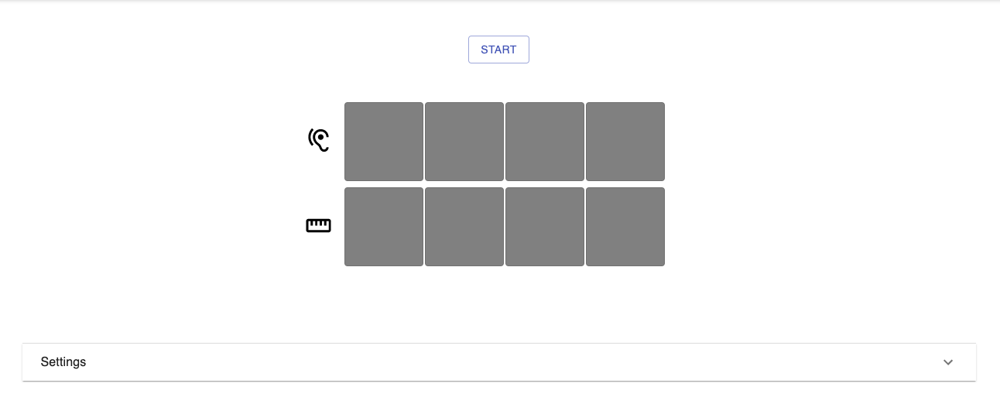

  
<em>https://eartraining.arthurthefourth.com</em>

## Purpose

I've always been convinced that there's a better way to train your ear to recognize and play back melodies than what exists out there, and I've been working on various solutions to that for almost 20 years now. There are two main goals with this one:

1) To build the connection between the sound of a note or phrase in context and the physical feeling of playing it on your instrument, bypassing the intermediate step of note names, interval names, and notation. I'm not sure how well this works for beginners, but if you already know your theory, and just want to practice, this feels much more immediate.

2) To allow the user to practice with phrases that match their specific needs.

## Technology

This is a React app built with Gatsby and tested with Jest. It uses [Tone.js](https://github.com/Tonejs/Tone.js/) to make sound and [Webmidi](https://github.com/djipco/webmidi) to take MIDI input from the user's attached MIDI controller. As such, it only works in browsers that support WebMIDI, i.e. Chrome, Opera, and Edge. It's not in any way optimized for mobile, and has only at the moment been tested in Chrome.

At the moment, there's no login or data storage. It's just a static app hosted on Netlify at https://eartraining.arthurthefourth.com 

## How It Works

The app plays an opening chord to give you context, then it plays four notes. Your job is to play those four notes back on your MIDI controller. You can choose any root note, but at the moment, it only supports major tonality, and a few different "scale" types: major scale, major pentatonic, major triad, and "do re mi".

Octaves are ignored, so if the computer plays, for example, `C4 D3 E3 A3`, and you play back `C2 D3 E3 A2`, it will call that correct. This is a quick-and-dirty implementation to keep people from having to fiddle around with octaves (especially on small MIDI controllers), but I'm certainly open to other options.

## Future Plans

I've got a few features I'd definitely like to add:

- Some sort of point system. Ideally this could keep track of what specific roots, scales, and intervals you have trouble with.
- Minor scales/keys
- Musical phrases (right now, note selection is just randomized)
- Variable phrase length
- Variable tempo
- Remembering your progress across multiple sessions
- Unit tests

And some features I'm less sure about:

- Displaying note names when you make a mistake
- Optional time limit for playing the phrase back

## Contributing

I don't have much time to work on this at the moment, but I'd love to hear ideas and see contributions from other people, especially if their needs are different from mine.

- If you've found a bug, please create an issue.
- If you'd like to add a new feature, please create an issue so we can talk about it.
- If you'd like to tackle an existing issue, make sure it's ready to work on before you spend time coding! Then submit a PR, and I'll take a look.

And finally, please format the JavaScript in your PRs with Prettier!
